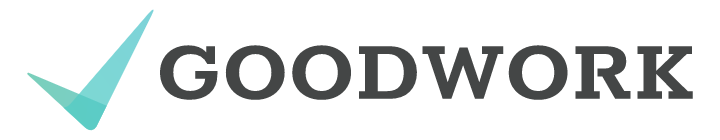

# __Notice:__ Project is currently paused, do not use

## Sponsored By: 

Self hosted project management and collaboration tool inspired by basecamp.

  
  
  
  
  
  

> Tech Stack: Goodwork is build using TALL stack ([Laravel](https://laravel.com/), [Livewire](https://laravel-livewire.com/), [Alpine](https://github.com/alpinejs/alpine), [TailwindCSS](https://tailwindcss.com/))

