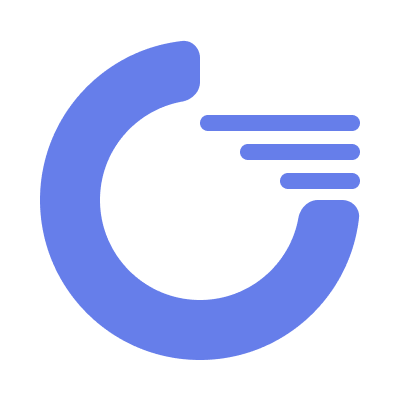

## Sponsored By: 

Self hosted project management and collaboration tool inspired by basecamp.

<b><a href="#about-goodwork">Overview</a></b>
|
<b><a href="#demo">Demo</a></b>
|
<b><a href="#installation">Installation</a></b>
|
<b><a href="#screenshots-top">Screenshots</a></b>
|
<b><a href="#contributing-top">Contributing</a></b>
|
<b><a href="#supporting-top">Supporting</a></b>
|
<b><a href="#credits-top">Credits</a></b>
|
<b><a href="#license-top">License</a></b>

## About Goodwork

Goodwork is a simple project management and collaboration tool for software teams. It is open source and [MIT licensed](https://github.com/iluminar/goodwork/blob/dev/LICENSE). Goodwork is a self-hosted software (no dependency on anyone else and only you keep your data).

Goodwork brings you all the components required for your project to run smoothly in one place so that you have single source of truth. Instead of using a collection of tools or service which makes everything messy with important details being hard to find because stuff is scattered all over the place, Goodwork organizes everything in a central place where everyone in the company knows what to do, knows where things stand and where to find stuff without having to ask around.

> Goodwork is available in 31 different languages! [list](https://github.com/iluminar/goodwork/wiki/Localization)

[Overview](https://github.com/iluminar/goodwork/wiki/Overview)

## Demo

You can test a live instance of Goodwork that we use (as a guest user) using the credentials below. This user has limited permissions so you'll only see a handful of the features. You can access the demo site at the following URL: https://usegood.work

`email: guest@example.com`

`password: guestpass`

## Installation

[Install via docker](https://github.com/iluminar/goodwork/wiki/Installation#setup-using-docker)

[Install manually](https://github.com/iluminar/goodwork/wiki/Installation#setup-usual-way-if-youre-not-using-docker)

## Screenshots <small>[↑Top](#about-goodwork)</small>

## Contributing <small>[↑Top](#about-goodwork)</small>

Thank you for considering contributing to the Goodwork Project! The contribution guide can be found in the [Contribution Guideline](https://github.com/iluminar/goodwork/wiki/Contribution-Guideline).

You can join the Goodwork Project via this link [link](https://usegood.work/register/invite-link/ovCPAFpnwIhrvqUrlvynarP9HVRBC5mH)

Also you can join the slack channel via this [link](https://discord.gg/4DvTQsc)

## Supporting <small>[↑Top](#about-goodwork)</small>

### Be a sponsor

Goodwork is an MIT-licensed open source project with its ongoing development made possible thanks to the support by our amazing backers.

Support the development of "Goodwork" by being a sponsor

You can also fund specific issues on Issuehunt and the money will be distributed to contributors and maintainers.

### Professional Support

If you need professional support or custom functioanlity please send an e-mail to searching.nehal@gmail.com.

## Security Vulnerabilities <small>[↑Top](#about-goodwork)</small>

If you discover a security vulnerability within Goodwork, please send an e-mail to searching.nehal@gmail.com instead of creating new issue. All security vulnerabilities will be promptly addressed.

## Credits <small>[↑Top](#about-goodwork)</small>

- Author: [Nehal Hasnayeen](https://github.com/Hasnayeen) (https://hasnayeen.github.io)

- Illustrations Credit: [Undraw](https://undraw.co/)

- [Full Contributors List](https://github.com/iluminar/goodwork/graphs/contributors)

## License <small>[↑Top](#about-goodwork)</small>

Goodwork is open-sourced software licensed under the [MIT license](http://opensource.org/licenses/MIT).
